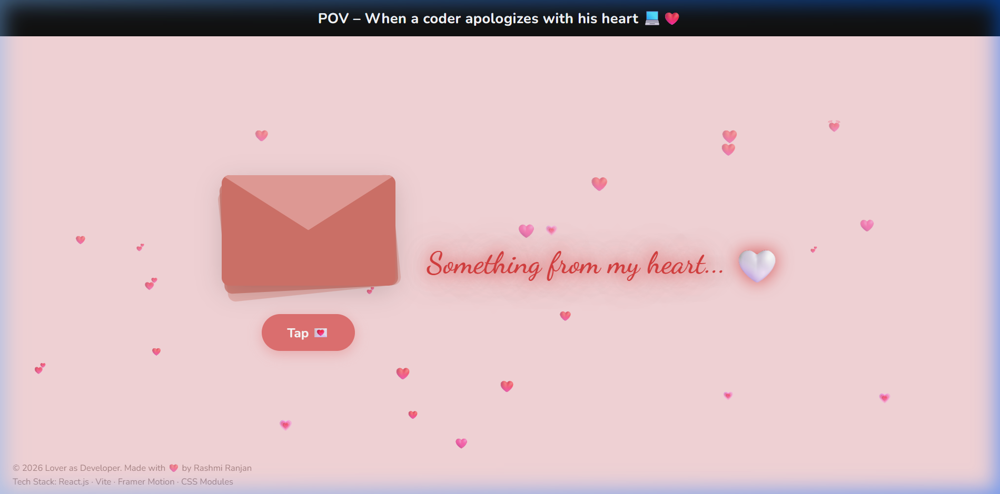
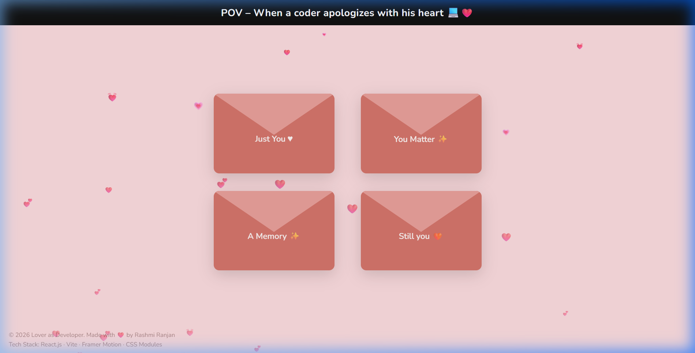
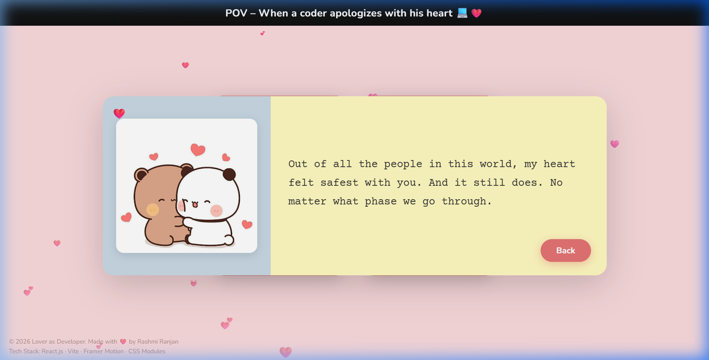
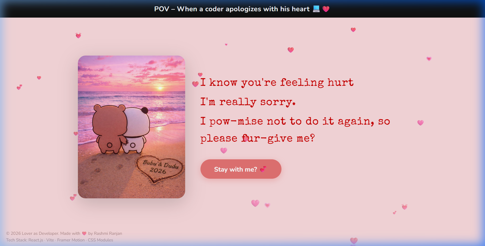
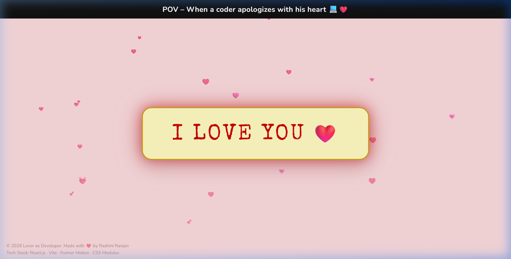

<h1 align="center">💻❤️ Lover as Developer</h1>

<p align="center">
  <em>"When words fail, code speaks — a developer's heartfelt apology, built one component at a time."</em>
</p>

<p align="center">
  
  
  
  
  
</p>

---

## 🌐 Live Demo

✨ Experience it live → **[https://loverasdeveloper.vercel.app/](https://loverasdeveloper.vercel.app/)**

> A cinematic, interactive love-letter experience — built with code and emotion.

---

## 📖 Description

**Lover as Developer** is an interactive, animated web experience built with React + Vite. Instead of flowers or chocolate, a developer pours his heart into components, animations, and typed messages.

Open the site to find four mysterious envelopes. Each holds a personal letter with a photo and a heartfelt message typed out in real time. After reading all four, a climax screen appears with a final confession — ending with the ultimate question: *"Stay with me? 💕"*

---

## ✨ Features

| Feature | Description |
|---|---|
| 💌 **Animated Envelope System** | 4 envelopes fly in from screen corners, clickable in any order |
| ⌨️ **Typewriter Effect** | Letters type themselves out character by character, line by line |
| 📸 **Dynamic Photos** | Each envelope has its own personal photo — easily swappable |
| 🎭 **Climax Interaction** | Full-screen confession with auto-typing lines and a "Stay with me?" button |
| ❤️ **Final Love Screen** | A glowing yellow card zooms in with "I LOVE YOU ❤️" |
| 🎵 **Background Music** | Soft looping music plays from first user interaction |
| 🌸 **Floating Hearts** | Hearts float upward on landing, fall downward after tap |
| 📱 **Mobile Responsive** | Fully responsive layout for all screen sizes |
| 🚀 **Smooth Animations** | Powered by Framer Motion — fly, zoom, pop, fade transitions |

---

## 📸 Screenshots

### 🌸 Landing


### 💌 Envelope Grid


### 📄 Letter View


### 🎭 Climax Screen


### ❤️ Final Screen


---

## 🛠️ Tech Stack

| Technology | Purpose |
|---|---|
| **React 18** | Component architecture & state management |
| **Vite 5** | Lightning-fast dev server & production build |
| **Framer Motion 11** | Envelope fly animations, letter pop-ups, zoom transitions |
| **CSS Custom Properties** | Single-source theme system (fonts, colors, spacing) |
| **Google Fonts** | Nunito · Special Elite · Dancing Script · Courier Prime |
| **Web Audio API** | Background music via `useRef` + native `Audio` |

---

## 🚀 Deployment

This project is successfully deployed on **Vercel** with an optimized production build.

- ⚡ Fast loading via Vite build (built in ~1.3s)
- 🌍 Global CDN via Vercel edge network
- 🎵 Background music fully supported
- 📦 Optimized static assets with content-hashing
- 🖼️ All images processed and hashed at build time

---

## 💻 Getting Started

### Prerequisites
- Node.js 18+
- npm 9+

### Installation

```bash
# Clone the repository
git clone https://github.com/Rashmiranjantandia/lover-as-developer.git
cd lover-as-developer

# Install dependencies
npm install

# Start the development server
npm run dev
```

Open [http://localhost:5173](http://localhost:5173) in your browser.

### Build for Production

```bash
npm run build    # Optimised production bundle → dist/
npm run preview  # Preview the production build locally
```

---

## 📁 Folder Structure

```
lover-as-developer/
├── public/
│   ├── favicon.svg          # Pink heart favicon
│   └── music.mp3            # Background music (looping)
│
├── screenshots/             # README preview images
│   ├── landing.png
│   ├── envelopes.png
│   ├── letter.png
│   ├── climax.png
│   └── final.png
│
├── src/
│   ├── assets/              # Personal photos (Img1.jpg – Img5.jpg)
│   │
│   ├── components/
│   │   ├── ClimaxScreen.jsx   # Confession with auto-typing
│   │   ├── EnvelopeGrid.jsx   # 2×2 animated envelope grid
│   │   ├── FinalScreen.jsx    # I LOVE YOU card
│   │   ├── FloatingHearts.jsx # Animated heart particles
│   │   ├── Footer.jsx         # Fixed credit footer
│   │   ├── LandingScreen.jsx  # Initial landing screen
│   │   ├── LetterCard.jsx     # Letter popup with photo + typing
│   │   ├── TitleBar.jsx       # Black top bar
│   │   └── TypewriterText.jsx # Reusable typewriter component
│   │
│   ├── data/
│   │   └── envelopes.js     # ← Edit all messages & images HERE
│   │
│   ├── styles/
│   │   ├── theme.css        # ← Change fonts/colors HERE (global)
│   │   └── index.css        # All component styles
│   │
│   ├── App.jsx              # State machine + music controller
│   └── main.jsx             # React entry point
│
├── index.html
├── vite.config.js
├── package.json
└── README.md
```

---

## 🎨 Customisation

All content lives in **one file** → `src/data/envelopes.js`

```js
export const ENVELOPES = [
  {
    name: 'Just You ♥',
    image: Img1,           // swap with your photo
    message: 'Your message here...',
  },
  // 3 more envelopes...
];
```

All fonts and colors live in **one file** → `src/styles/theme.css`

```css
:root {
  --font-ui:     'Nunito', sans-serif;
  --font-letter: 'Courier Prime', monospace;
  --font-glow:   'Dancing Script', cursive;
  --font-climax: 'Special Elite', cursive;
  --color-bg:    #FADADD;
}
```

---

## 👤 Author

**Rashmi Ranjan**

> Built with love, late nights, and a lot of `console.log("I miss you")` 💻❤️

---

## 📄 License

MIT — feel free to fork and send your own love letter 💌

---

<p align="center">Made with ❤️ by Rashmi Ranjan &nbsp;·&nbsp; © 2026 Lover as Developer</p>
